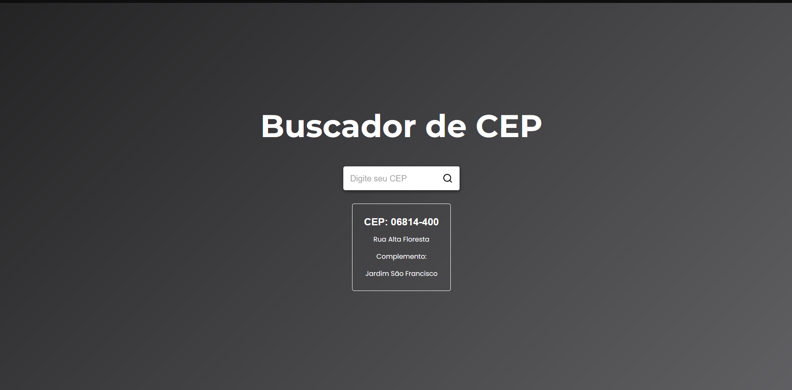

<h1 align="center">CEP SEARCHER</h1>

Projeto para facilitar acesso a portifólios, redes sociais e links em geral

<a href="#-tecnologias">Tecnologias</a>
|
<a href="#-projeto">Projeto</a>
|
<a href="#-layout">Layout</a>
|
<a href="#-memo-licença">Licença</a>

 

 

## 🚀 Tecnologias

Esse projeto foi desenvolvido utilizando:

- 
- CSS
- JS
- React
- Git e Github

## 💻 Projeto

Projeto desenvolvido em 07.04.2023: Feito para facilitar busca de ceps

## :memo: Licença

Esse projeto está sob a Licença MIT.

---

### Link to the project

https://buscador-cep-murex.vercel.app/

Feito com 🤍 por [Daniel](https://instagram.com/_dannielsz)
